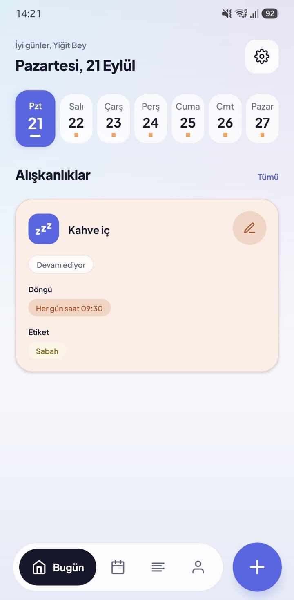
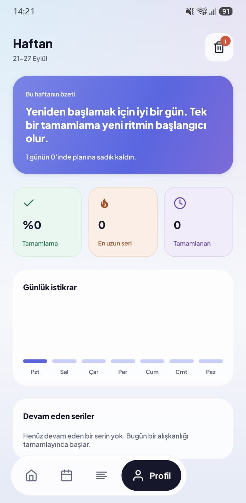

<p align="center">
  
</p>

<h1 align="center">PlanNow</h1>

<p align="center">
  <strong>The app and interface are available in both Turkish and English.</strong>
</p>

<p align="center">
  Alışkanlıklarını, toplantılarını ve aboneliklerini tek yerde düzenleyen, sade ve akıcı bir kişisel planlama uygulaması.<br/>
  A calm, fluid personal planner for habits, meetings and subscriptions.
</p>

<p align="center">
  
  
  
  
  
</p>

<p align="center">
  
  &nbsp;&nbsp;&nbsp;
  
</p>

---

## 🇹🇷 Hakkında

PlanNow, Yiğit Akın Kaya tarafından tasarlanıp geliştirilmiş ve kaynak kodu herkese açık olarak paylaşılmıştır.
Kod ticari amaçlarla kullanılamaz ve dağıtılamaz; okulunuzda ve kişisel öğreniminiz için serbestçe kullanabilirsiniz.
Sorularınız için lütfen X üzerinden ulaşın: [x.com/yigitakinkaya](https://x.com/yigitakinkaya)

Proje Expo (SDK 57) ile uyumlu olarak geliştirilmiştir; Android ve iOS'ta çalışır.

## 🇬🇧 About

PlanNow was designed and developed by Yiğit Akın Kaya, and its source code is publicly shared.
It may not be used or distributed for commercial purposes; you are free to use it for school and personal learning.
For questions, please reach out on X: [x.com/yigitakinkaya](https://x.com/yigitakinkaya)

The project is fully Expo-compatible (SDK 57) and runs on Android and iOS.

---

## Features

- **Habits** — daily, weekly, every-N-days/weeks, monthly and yearly cycles; start/end dates; targets; tags and colors
- **Today view** — week strip, swipe/tap to complete, streaks and a little confetti on completion
- **Calendar** — month view with habits, meetings and subscription renewals
- **Meetings & subscriptions** — one-off meetings and recurring subscriptions with renewal reminders
- **Profile** — an encouraging weekly summary derived from your own completion history
- **Local notifications** — reminders that are cancelled/rescheduled with their data, never orphaned
- **Light / dark theme**, custom ordering, archive and a 7-day trash
- **Turkish & English** — switch any time from Profile → 🌐; notifications follow the chosen language
- **Local-first & private** — no account, no backend, no analytics; everything stays on the device

## Tech stack

| Area | Technology |
|---|---|
| Framework | Expo SDK 57, React Native 0.86 (New Architecture, Hermes), React 19 |
| Language | TypeScript (strict) |
| Navigation | Expo Router (file-based tabs + modals) |
| State | React state + Context |
| Persistence | AsyncStorage behind a small service layer |
| Notifications | expo-notifications (local only) |
| Motion | Reanimated 4, Gesture Handler |
| Typography | Plus Jakarta Sans (OFL) |

## Architecture

```
UI (app/, src/components/)
  → application logic (src/services/habitStore.tsx, src/services/actions/)
    → services (src/services/storage.ts, src/services/notifications/)
      → AsyncStorage / expo-notifications
```

```
app/          routes — (tabs)/ Today, Calendar, Feed, Profile · habit/ meeting/ subscription/ modals · settings/
src/
  components/ UI grouped by feature
  services/   store, actions, storage, notifications
  utils/      pure logic — dates, habit schedule, streaks, subscriptions
  theme/      design tokens + light/dark theme
  data/ types/ hooks/
assets/       fonts, app icons
```

Design decisions:
- **Design tokens** (color, type scale, spacing, radii, shadows) live in one place: `src/theme/tokens.ts`.
- **Notifications are tied to data** — every scheduled reminder is cancelled or rescheduled with its record, and orphaned reminders are cleaned on launch.
- **Derived, not duplicated** — streaks, stats and the profile summary are computed from completion records, not stored.

## Getting started

```bash
npm install
npx expo start          # Expo Go (reminders need a development build)
npx expo run:android    # development build
npx expo run:ios
```

## Translations

Want PlanNow in your language? Copy one language file, translate it and register it with a single line — step-by-step guide: [src/languages/README.md](src/languages/README.md).

PlanNow'u kendi dilinize çevirmek ister misiniz? Adım adım rehber: [src/languages/README.md](src/languages/README.md).

## License

[PolyForm Noncommercial 1.0.0](LICENSE) — free for personal and educational use; commercial use is not permitted.
© 2026 Yiğit Akın Kaya
